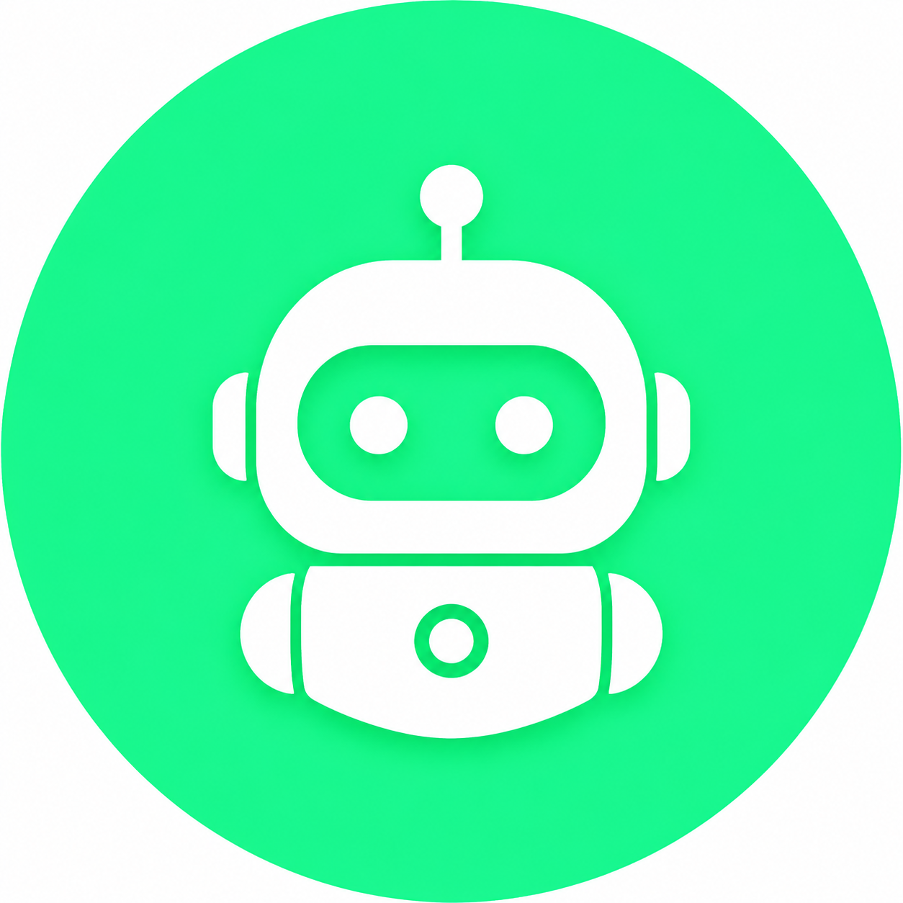

# 🤖 TeleBridge - Telegram Bot Manager

TeleBridge es una potente aplicación de escritorio (Electron + Next.js) que te permite gestionar múltiples bots de Telegram de forma centralizada. Conéctalos a cualquier modelo de Inteligencia Artificial a través de **OpenRouter** de manera automática y sin complicaciones.



## ✨ Características

- **Gestión Multi-Bot**: Añade y configura tantos bots como necesites.
- **Túnel Automático**: Integración nativa con **ngrok** para crear URLs públicas HTTPS al instante.
- **IA Fallback System**: Carrusel de más de 25 modelos gratuitos de OpenRouter. Si uno falla, la app salta al siguiente automáticamente.
- **Sin Servidores**: Todo corre localmente en tu ordenador.
- **Logs en tiempo real**: Visualiza la comunicación entre Telegram y la IA.
- **Diseño Premium**: Interfaz moderna, oscura y fluida.

## 🚀 Instalación

1. **Clonar el repositorio**:
   ```bash
   git clone https://github.com/tu-usuario/telebridge.git
   cd telebridge
   ```

2. **Instalar dependencias**:
   ```bash
   npm install
   ```

3. **Compilar la aplicación**:
   ```bash
   npm run build
   ```

4. **Ejecutar**:
   ```bash
   npm run desktop
   ```

## ⚙️ Configuración

1. **Variables de Entorno**: Copia el archivo `.env.example` a `.env` y asegúrate de que las rutas son correctas.
2. **ngrok**: Ve a los ajustes (icono de engranaje ⚙️) y pega tu `Authtoken` gratuito de [ngrok](https://dashboard.ngrok.com/). Pulsa "Guardar y Activar Túnel".
3. **Bots**: Añade un bot con su Token de Telegram (@BotFather) y tu API Key de [OpenRouter](https://openrouter.ai/).
4. **Instrucciones**: Puedes darle instrucciones personalizadas a cada bot para que actúe de una forma específica.

## 🛠️ Tecnologías

- **Frontend**: Next.js 15, Tailwind CSS, Framer Motion, Lucide React.
- **Backend**: Next.js API Routes, Electron.
- **Base de Datos**: SQLite con Prisma ORM.
- **Conectividad**: ngrok SDK.

## 📜 Créditos y Méritos

Este proyecto ha sido posible gracias a la colaboración de:
- **TeleBridge Team** (Idea Original y Desarrollo)
- **Z AI** (Arquitectura y Sistemas)
- **Google Antigravity** (Inteligencia Artificial y Pair Programming)
- **OpenRouter** (Modelos de IA)

---
MIT License © 2025 TeleBridge Team
